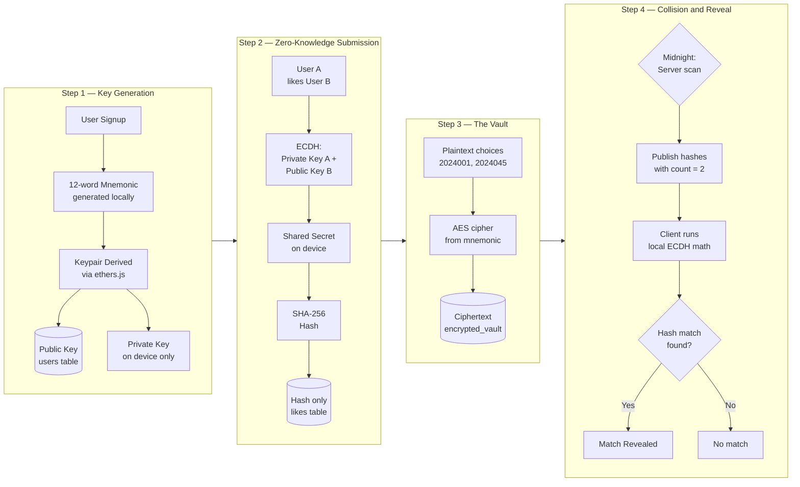

<h1>You Deserve One 💘</h1>

<i><code>A secure, on-device encrypted matchmaking platform built exclusively for IIITDMJ</code></i>

---
## Project Overview
**You Deserve One (YDO)** bridges the gap of unspoken campus connections by offering a completely safe, anonymous matchmaking platform for students. 

What makes YDO different from a simple form is its ***Anonymity Guarantee:***
*"The database, the developers, and the server infrastructure will never have the mathematical ability to see who a user liked or who matched with whom. Matches are calculated via cryptographic collision."*

---
## Features

YDO is crafted around these core operational pillars:

* **Campus Exclusive Authentication:**  Restricted solely to institutional credentials, login with ***'iiitdmj.ac.in'*** only. 
* **Multiple Selections:**  Users can submit up to 3 choices without anyone else knowing. 
* **Synchronized Reveal:**  The magic happens simultaneously on February 14th at 00:00 mutual selections instantly reveal a match. 
* **No secrets revealed:**  Unmatched tokens remain as a one way SHA256 hash in database to guarantee continuous data privacy. 
---
## Cryptographic Workflow - <i>'The Heart of YDO'</i>

 

---

## Tech Stack
* **Frontend:**
    * Next.js   
* **Backend:**
   * Supabase   
* **Authentication:** 
   * Supabase Auth   
* **Cryptography:**
  * ethers.js and crypto-js

 ---

## Contributions 
We welcome contributions through the BSoC Contributor Guidelines! 
Development tasks are strictly divided into three core domains: 

1. Frontend  
2. Infrastructure and Database  
3. Core logic and Cryptography 

Please see our **[CONTRIBUTING.md](CONTRIBUTING.md)** for getting started.

---

## Acknowledgement
We extend our sincere gratitude to: 
* All **contributors** who are dedicating their time and effort for shaping YDO.
* The broader **open-source community** for providing invaluable tools, libraries, and inspiration.
* Our beloved TPC ❤️ - The Programming Club, IIITDMJ.

---

## Maintainers & Mentors:
  - Arunit
  

   - Sampath

---

~ with 💖 by Team YDO.

